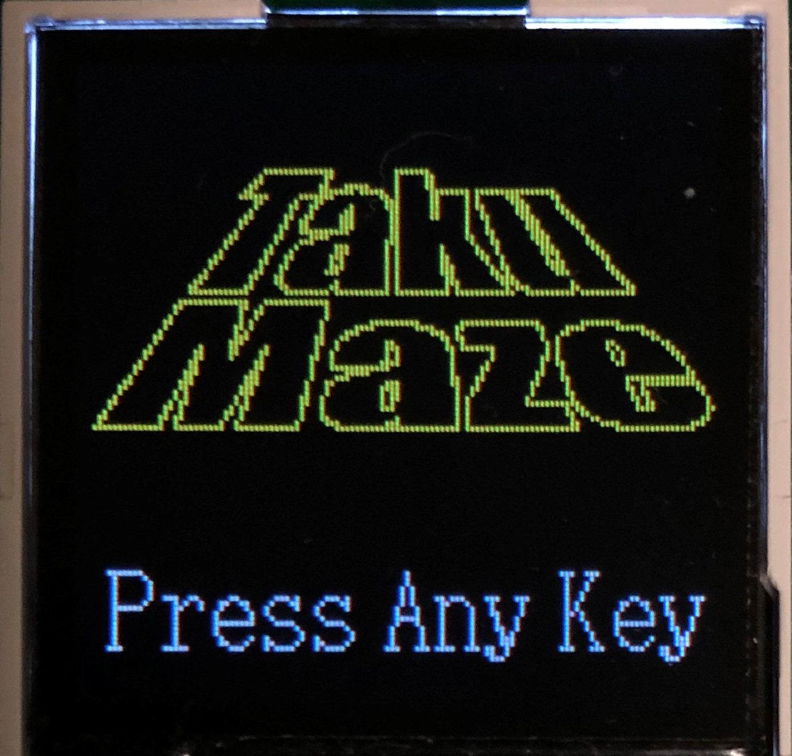
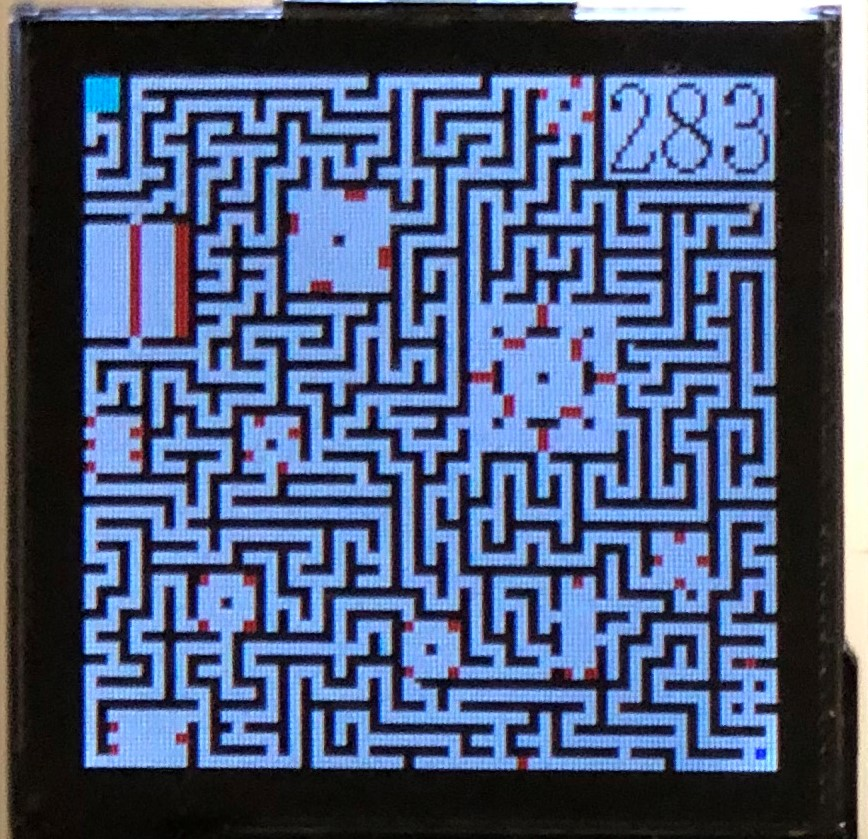
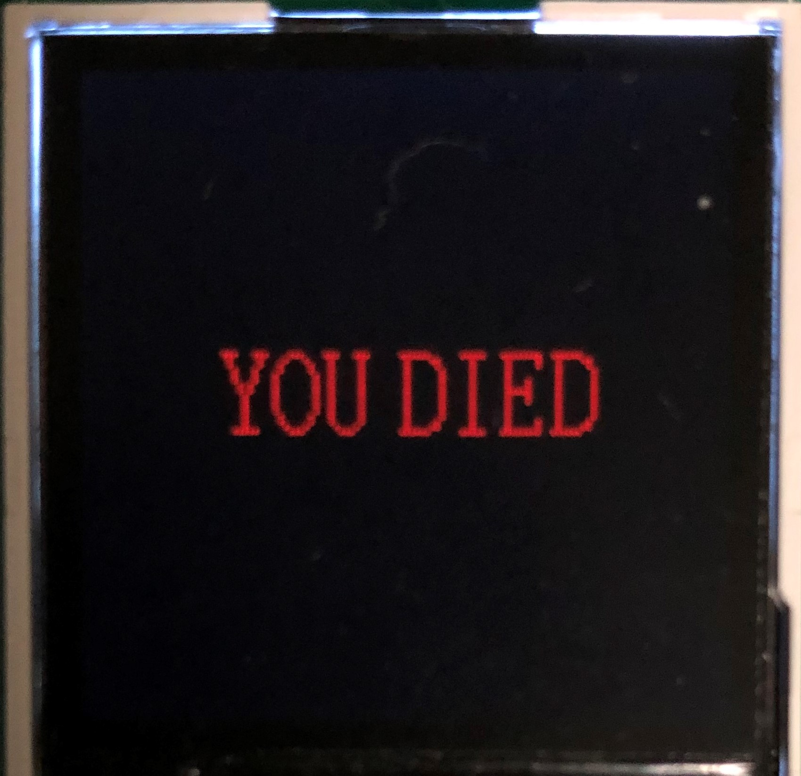
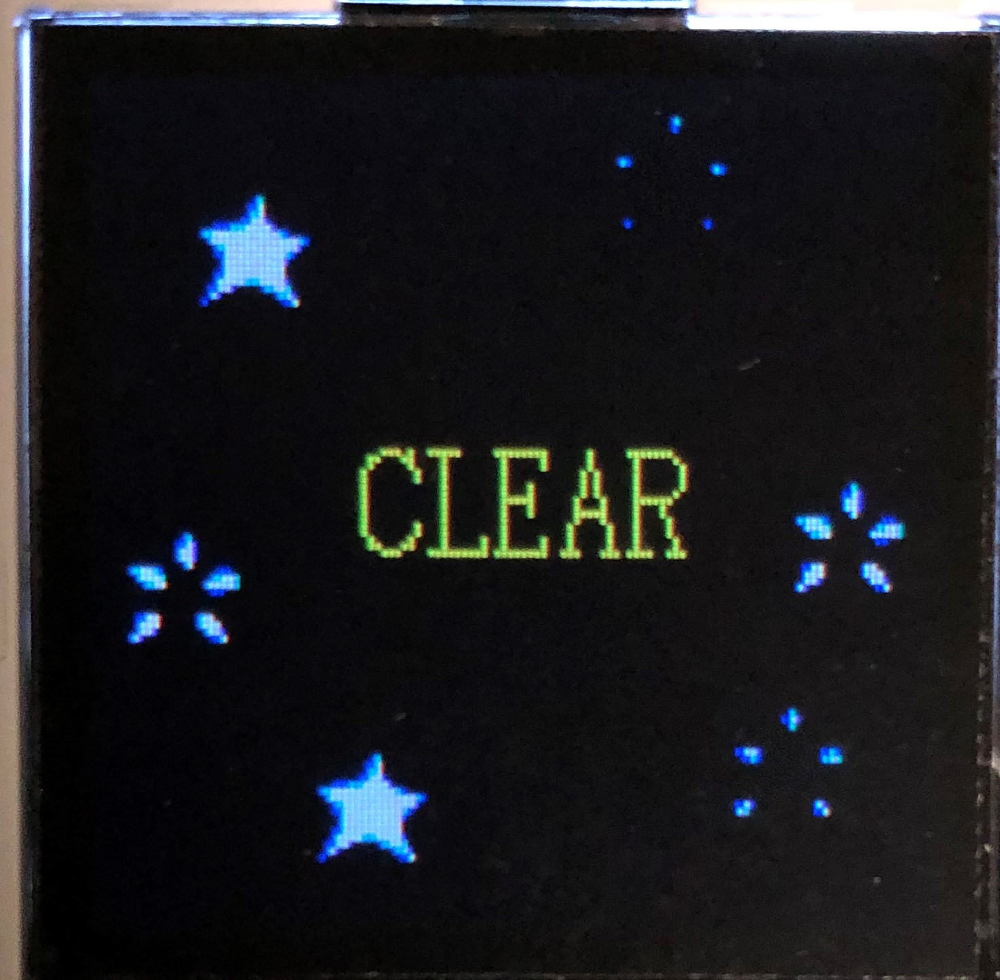

# TakuMazeOnMieruEMB
This is Maze Application (Game). Runs on MieruEMB.
 

## 1 Start
press any button to start maze application.  

## 2 How to play
This game is explore from under right start position to up left goal area and move to goal. There are red walls which are enemy in this maze. If you touched it then gameover (you died). Be carefully move and have fun!

MieruEMB equip three buttons. The press left button to move to left, right button is move to right, center button is move to up. if you want to move to under , press left and right button.This operation difficult, please challange some times.

## 3 GameOver
If you touched red walls, game over and display "You dead". But press any button and transition to title screen, you can play again.

## 4 Game Clear
If you are able to went to Goal area, you can see the "Game Clear" screen.  
**Congratulation!**  

If you want to one more play, please press any key. Transition to title screen.
  

---
Developer : Takunology 
Collaborator / Design : [nyabingo](https://github.com/nyabingo) 
Thanks!!